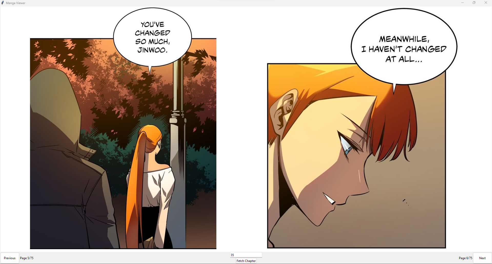

# Manga Viewer Project

## Introduction

The Manga Viewer Project is born out of a need for a more traditional and comfortable reading experience for manga enthusiasts. While most online manga platforms offer a scrollable view for reading, this can often be cumbersome, especially for readers who prefer a faster or more controlled pace. Our project transforms these scrollable manga views into a format that resembles reading a physical comic book, where readers can flip through pages at their leisure.

## Project Overview

This application fetches online manga, which are typically presented in a long, scrollable format, and processes them into discrete, well-defined pages. These pages are then displayed two at a time, side by side, much like an open comic book. This not only makes for easier reading but also brings the familiar and beloved experience of reading a physical manga or comic book into the digital realm.

Utilizing PyQt5 for its robust graphical capabilities, the Manga Viewer provides an intuitive and enjoyable reading experience, focusing on ease of use and readability.

## Key Features

- **Comic Book-Like Viewing**: Pages are displayed statically side by side, allowing users to "flip" through the manga as they would with a physical comic book.
- **Asynchronous Fetching**: Given that parsing and processing manga pages can be time-consuming—approximately one minute per chapter for tested mangas—subsequent chapters are fetched asynchronously. This ensures a smoother reading experience, minimizing wait times as readers progress through chapters.
- **Prefetching Option**: For users who prefer having all chapters ready in advance, the application includes functionality to prefetch entire mangas. This feature loads all selected chapters before the reading session begins, ensuring uninterrupted reading.
- **Selection View**: Upon launching, the application presents a selection view where users can choose their desired manga and chapter. This user-friendly interface ensures ease of access to a wide range of manga titles and their respective chapters.

## Getting Started

To start the application, run the project directly from your command line or preferred IDE.

```bash
python -m src
```

This will open the selection view, where you can choose a manga title and its chapter for reading. Once both are selected, the chapter view will open, displaying two pages side by side for your reading pleasure.

To prefetch all chapters, run:

```bash
python -m src.mangas.YOUR_MANGA_NAME
```

## Comparing Views

The following images illustrate the difference between the conventional scrollable view and our application's page-flipping approach, showcasing the enhanced reading experience provided by the Manga Viewer.

The following image is a typical online manga viewer, where the manga is presented in a long, scrollable format:


In contrast, the Manga Viewer displays pages side by side, much like an open comic book:



These visuals highlight the difference between the conventional scrollable view and our application's page-flipping approach, showcasing the enhanced reading experience provided by the Manga Viewer.
